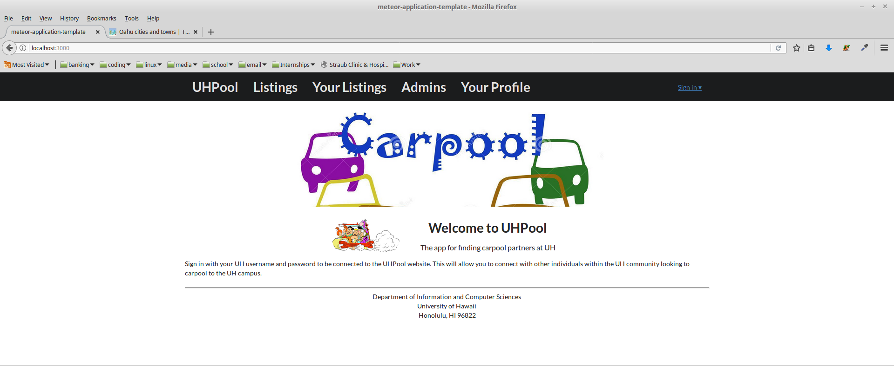
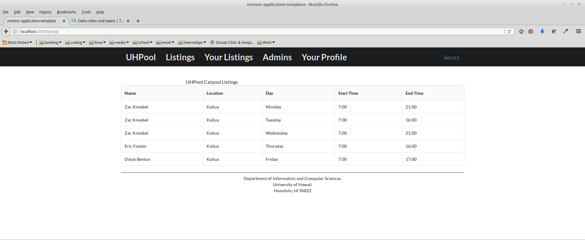
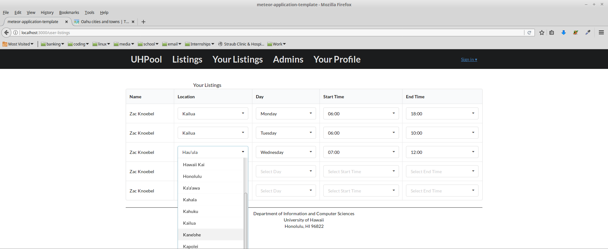
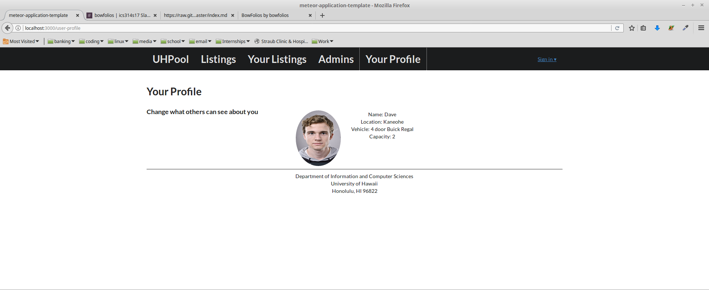
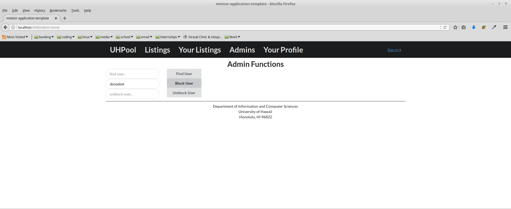

# UHPool

UHPool is an app for students and faculty of The University of Hawaii, to find people that they can carpool with. The users must have a UH username and password to log in.

#### Landing Page
This is the page where a user will first land before they log in.

#### Listings Page
This shows listings of other users in the UHPool System

#### Your Listings Page
This page allows the user to add their schedule and location to the carpooling system. This allows the UHPool app to connect people with the same type of driving situations.

#### User Home Page
This allows users to control what other users can see about them. Meeting strangers can be scary, so add a picture and a description.

#### Admin Home Page
This allows control for admins to block inappropriate users.

